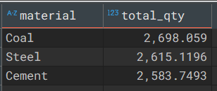

#  Transport Operations SQL Analysis (Jan–Mar 2025)

##  Project Overview
This project aims to analyze transport trip data collected from January to March 2025. The objective was to uncover insights related to trip performance, cost efficiency, vehicle utilization, delay patterns, and operational KPIs. The analysis was performed entirely using SQL.

---

##  Tools Used
- **PostgreSQL / SQL**
- **Dbeaver** (for organizing and tracking queries)
- **Excel** (for cross-validation where required)
- **VS Code** (for managing the files)

---

##  Dataset Summary
The dataset includes trip-level information:
- `trip_id`, `vehicle_id`, `driver_id`, `material`, `vehicle_type`
- `loading_point`, `unloading_point`, `loading_qty`, `unloading_qty`, `damage_qty`
- `fuel_qty`, `freight`, `total_cost`, `distance`, `bonus`
- `planned_pod_date`, `actual_pod_date`, `delay_flag`

---

##  Questions Answered (with Results)

###  Data Cleaning & Validation

**1. Are there any missing values? Which columns have them?**  

**2. Are all data types correct (e.g., dates, numbers, categories)?**  

**3. Are there any duplicate trip IDs?**  

**4. Are the trip dates within Jan–Mar 2025?**  

**5. Is loading quantity ≥ unloading quantity for each trip?**  

**6. Are numerical fields (fuel_qty, freight, costs, etc.) non-negative?**  

---

###  Trip & Vehicle Insights

**7. How many total trips are there?**  

**8. How many trips per vehicle per month? Any under-used vehicles?**  
 

***underutilised vehicles*** 

**9. What’s the distribution of vehicle types?**  

**10. What are the top 5 most common loading–unloading point combinations?**  

**11. Which routes have the longest distances?**  

---

###  Quantity & Material Insights

**12. What’s the average loading/unloading quantity?**  

**13. Which materials are most frequently transported?**  

***based on Loading Quantity*** 

***based on Trips***

**14. Which materials have higher damage_qty?**  

**15. What’s the damage % trend by material?** 

**16. Are some materials more prone to damage?**  

---

###  Fuel & Financial Metrics

**17. What’s the monthly fuel consumption trend?**  

**18. What is the average fuel efficiency (distance per litre)?**  

**19. What is the average total cost per trip?**  

**20. What is the average freight per trip?**  

**21. What is the freight-to-total-cost ratio?**  

**22. Are there trips where freight < total cost? How rare are they?**  

***how rare are they*** 

**23. Which trips have very low or high margin?**  
***below 10% margin*** 
 
***above 10% margin*** 

**24. Which vehicle has the highest average trip margin?**  

**25. What’s the most profitable route?**  

**26. How does distance affect cost or freight?**  

---

###  Delay & Bonus Analysis

**27. How many trips are marked as Delayed vs On-Time?**  

**28. What’s the average delay duration (planned vs actual pod_date)?**  

**29. Which routes or drivers are associated with higher delays?**  
***delay by route***  
  

***delay by drivers***  
 

**30. Is there a pattern in delay_flag over months?**  

**31. Are delayed deliveries more costly?**  

**32. How does bonus vary between delayed and on-time deliveries?**  

---

###  Driver Analysis

**33. Which drivers have the most trips?**  

**34. Any driver with consistently higher/lower trip costs?**  

---

>  *This project involved writing **57+ SQL queries** across various categories to uncover trends, validate data, and generate business insights.*